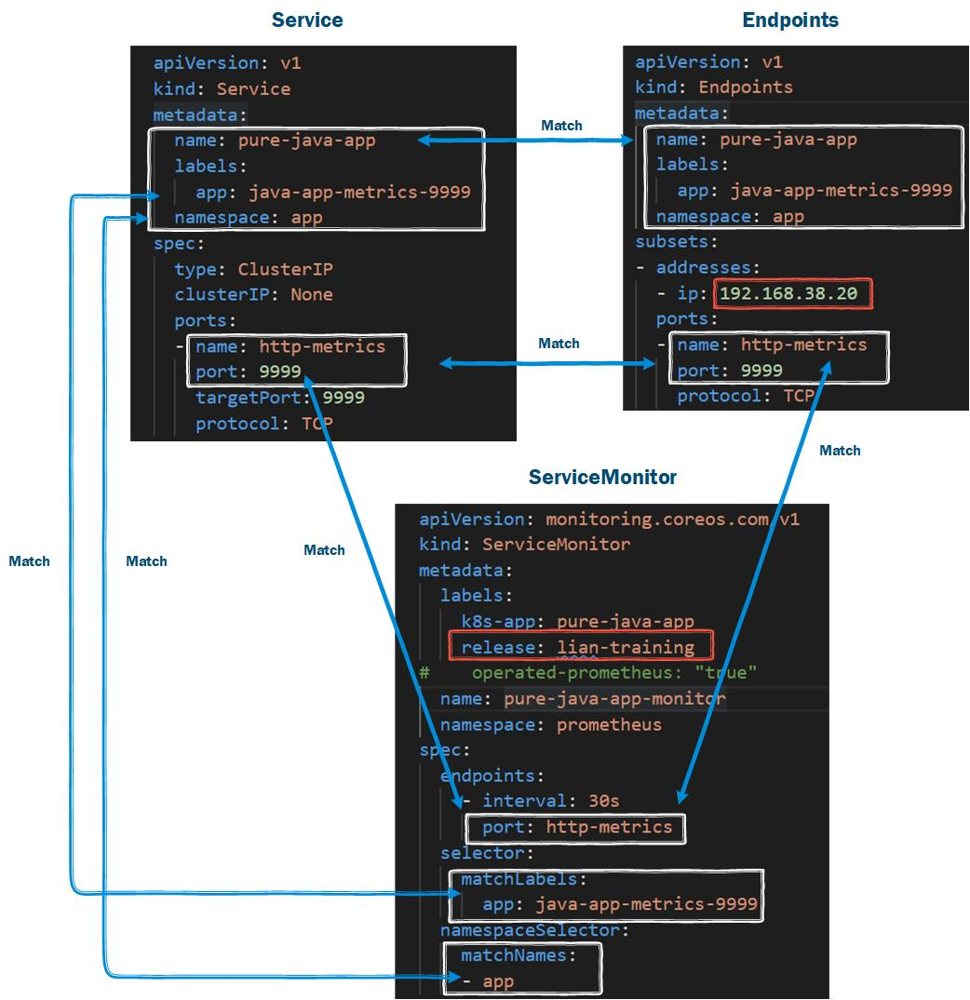
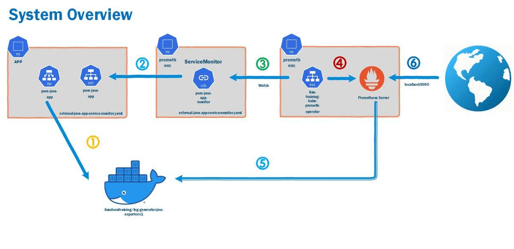

# Use Prometheus Monitor External Java App JVM
## Topics
- Environment Setup   
- What is Prometheus Operator?   
- What is ServiceMonitor?
- Create a ServiceMonitor to Monitor External Java App JVM
- Verify External Java App JVM Metrics in Prometheus UI

## Environment Setup
- [How to Add JAVA OPTS in Docker? | Java App Docker Image | Configure JAVA_OPTS in JAVA Docker Image](https://youtu.be/kAKtfh0u4xg)   
  -'docker run -e JAVA_OPTS='-javaagent:/jmx_prometheus_javaagent-0.16.1.jar=9999:/config.yaml'  --rm -d -p 9999:9999  lianduantraining/log-generator-jmx-exporter:v1' 
- [Use Helm 3 to Install Prometheus Stack on Minikube in 10 Mins](https://youtu.be/wfxu053rbbI)   
  - 'helm install lian-training prometheus-community/kube-prometheus-stack --namespace=prometheus --create-namespace --wait --version 33.0.0' 
  - 'helm list -n prometheus'
    

## What is Prometheus Operator? 
- A Kubernetes extension
- Manages Prometheus monitoring instances
- Use a labelSelector to add a ServiceMonitor. 

## What is ServiceMonitor?
- The Prometheus Operator automatically generates Prometheus scrape configuration based on the ServiceMonitor definition.
- YAML File: external-java-app-service-monitor.yaml    
   
  
```
kubectl get prometheus -n prometheus  
kubectl get prometheus -n prometheus lian-training-kube-prometh-prometheus -o yaml  
```


## Create a ServiceMonitor to Monitor External Java App JVM
- 'kubectl create -f  external-java-app-service-monitor.yaml'  
 


## Verify External Java App JVM Metrics in Prometheus UI
- 'kubectl port-forward service/prometheus-operated  9090 --namespace=prometheus'
- Targets http://localhost:9090/targets
- Graph http://localhost:9090/graph

## Summary   
- Environment Setup    
- Prometheus Operator   
- ServiceMonitor
- Demo Monitor External Java App via ServiceMonitor in Prometheus
- Verify External Java App JVM Metrics in Prometheus UI

<h7>
Icons are from 
https://github.com/prometheus-operator/prometheus-operator
https://www.docker.com/company/newsroom/media-resources
</h7>